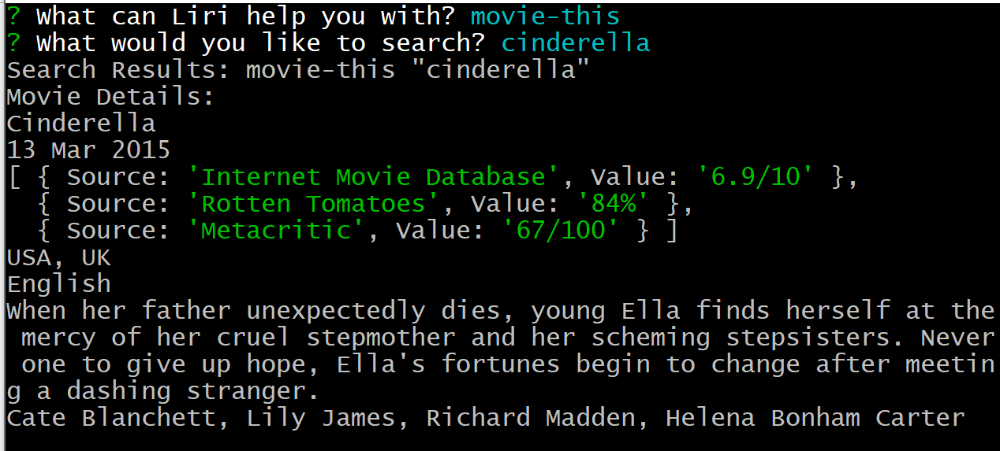

# Liri Node App

* The is a liri node app. This application uses node to act as a media search engine.
* The user has three options to choose from:         
   * movie (movie-this) 
   * music (spotify-this) 
   * concert(concert-this)

#### Screenshots:  
  
  

### Getting Started
Fork/clone this repo Run npm install for the node_modules in your favorite code editor. Run with node.js.

### Author
_Shantell Davis_
